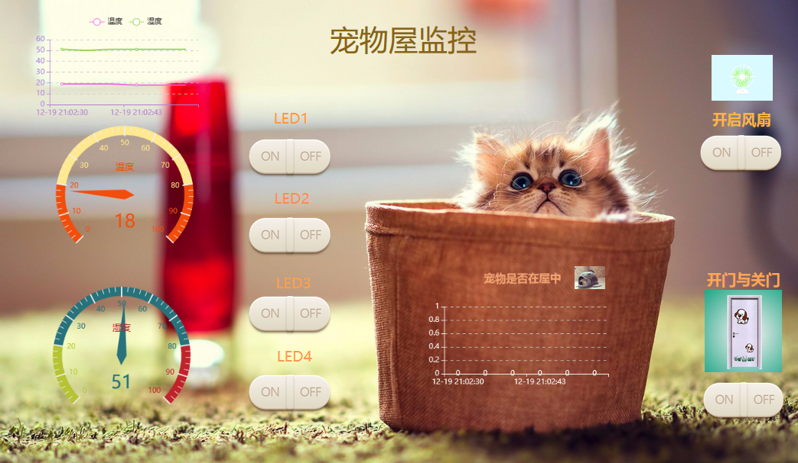

# PetHome_onenet
###基于STM32宠物小窝
>连接的是中移Onenet平台

####现在实现功能：
#####1.温湿度监测
#####2.宠物是否在屋内监测
#####3.宠物小窝灯的控制
#####4.宠物门的自动感应开关和远程控制

 >onenet平台应用查看链接：http://open.iot.10086.cn/appview/p/895c91cc7558503d278fc631e20e9645 
 